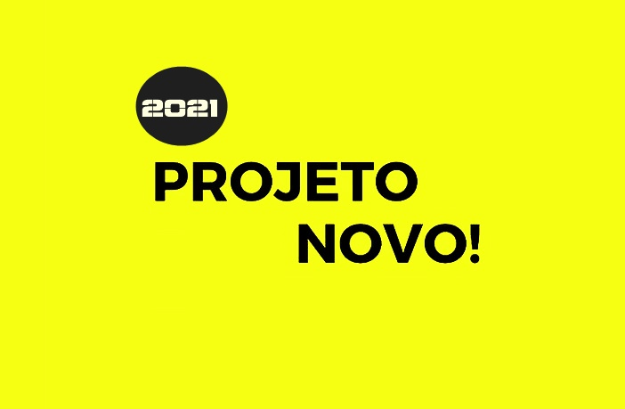

# Novo projeto

## Olá! 👋

[Desafio]() desafios o ajudam a melhorar suas habilidades de codificação ao construir projetos realistas.

** Para fazer este desafio, você precisa ter um bom conhecimento de HTML, CSS e JavaScript. **

## O desafio

Esse desafio é construir um website com varias funcionalidades de  e fazê-lo parecer o mais próximo possível do design.

Usaremos as ferramentas  como figmar para ajudsr a completar o desafio. 

Seus usuários devem ser capazes de:

- Veja o tamanho dos elementos ajustados com base no tamanho da tela de seus dispositivos

- Realize operações matemáticas como adição, subtração, multiplicação e divisão

- Ajuste o tema de cores com base em sua preferência

- Ainda em construção

## Implantando seu projeto

As mentioned above, there are many ways to host your project for free. Our recommend hosts are:

- [GitHub Pages](https://pages.github.com/)
- [Vercel](https://vercel.com/)
- [Netlify](https://www.netlify.com/)

## Feedback

Projeto em progresso!
Figma em andamento para estrutura do projeto final.

